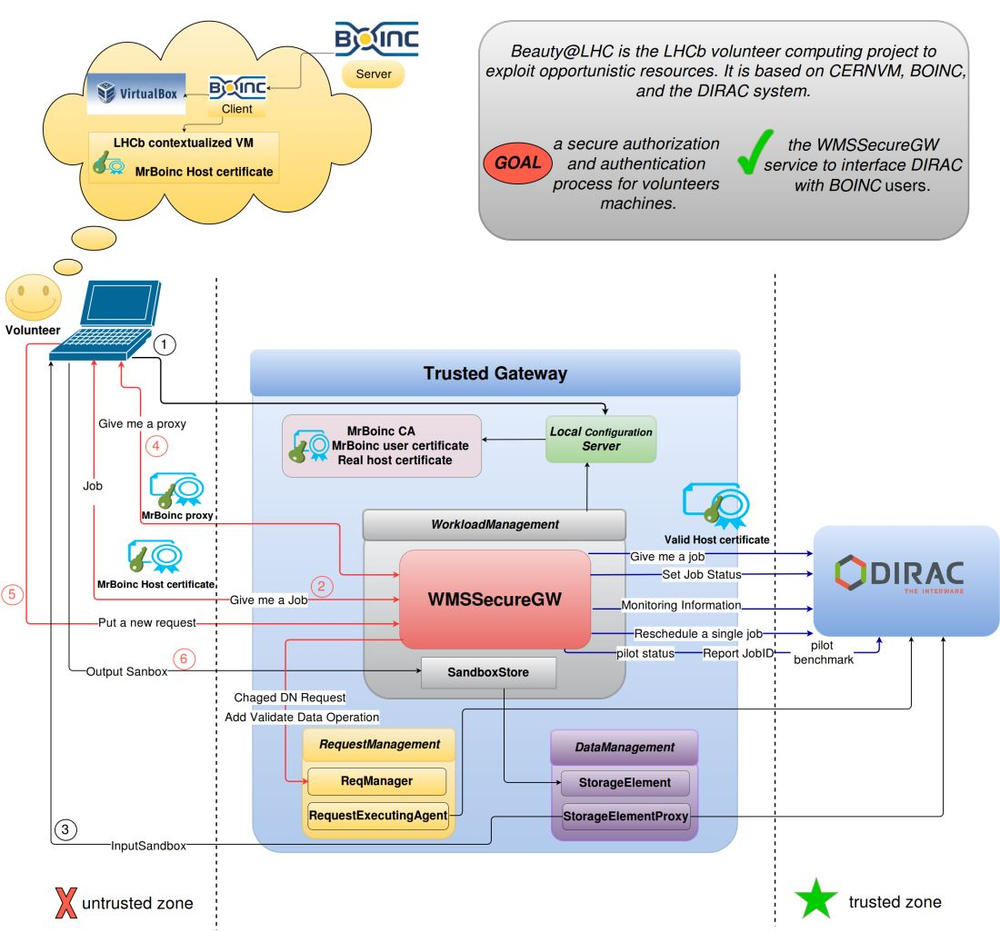

====================
Design of the system
====================

Generic principle:
******************
Two worlds, the trusted one (real Dirac system) and the untrusted one (Boinc client).
The security relies on the gateway.
In the untrusted world, we use only self sign certificates from a local CA.
The BOINC gateway has two dirac configuration files: one for the trusted world, one for the untrusted world which is the one that is served by the local CS and that the jobs will see.

.. _listOfBOINCComponents:

In the BOINC Gateway there are the following components:

- DataManagement:
    - StorageElement to upload the output of the Job
    - StorageElementProxy to fetch the input sandbox
- RequestManagement:
    - After the job execution, to forward to the trusted world the data after carefully checking it
- SandboxStore for the outputSandbox, which uses the local StorageElement
- Configuration server:
    - running the BOINC setup.
    - define all the URLs of all the systems to WMSSecureGW
- WMSSecureGW:
    - accept calls targeted at all systems (WMS, Monitoring, RMS, etc) and redirect them
      to the trusted world. (currently, Accounting goes directly to the real system, but this should be fixed)

The BOINC users only (almost, see below) talk to the WMSSecureGW, which redirects all the calls to the trusted world, using real host certificate.
From the BOINC user perspective, it is just like they are talking to the real system.

Steps for running a job:

0. The machine boots with a MrBOINC host certificate integrated in the image
1. The machine starts a pilot that contacts the BOINC configuration server.
2. The pilot asks for a job to the WMSSecureGW, which will ask one to the trusted world, and return it
3. The pilot download the InputSandbox through a call to the StorageElementProxy (How is the authentication done ? )
4. The pilot asks for a proxy to the WMSSecureGW. It will receive a MrBoinc proxy.
5. After the job has finished, the job will upload the output to the StorageElement on the BOINC gateway (as failover) and send a RMS Request to the WMSSecureGW (see details in gw setup)
6. The output sandbox is uploaded to the BOINC gateway

The Request will be executed by the local RequestExecutingAgent, which will transfer all the output data to the trusted world.

Authentication and Authorization
********************************

Input sandbox download
**********************

The download goes through a StorageElementProxy. This means that if the real Sandbox SE is a dirac service, we will use the host certificate of the boinc gateway. This is the only case that can work. If the SE were an outside service (eos, anything else), we would use the MrBoinc proxy, and then fail.

Output data upload
******************

The data is uploaded as MrBOINC to the BOINC-SE. The final copy to the real system will be done using the DN inserted to perform the replication request (see below).

Request modification
********************

When a request is done, it is intercepted by the WMSSecureGW, which changes the ownerDN and add a first Operation which is WMSSecureOutput.
For the time being, the ownerDN is always the one defined in `Operations/<setup>/BoincShifter/ProductionManager`. This should however change and be based on the actual job (see todo)
