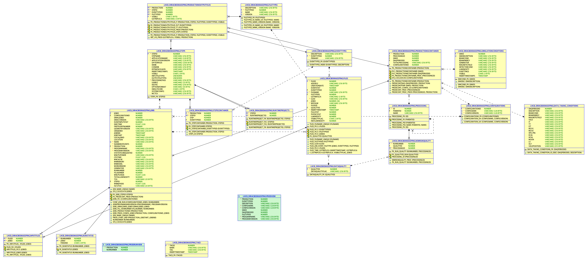

.. _databaseschema:
============================
Bookkeeping database schema 
============================

   
The schema can be recreated using the following files::

	LHCbDIRAC/BookkeepingSystem/DB/database_schema.sql
	
	LHCbDIRAC/BookkeepingSystem/DB/oracle_utilities_stored_procedures.sql
	
	LHCbDIRAC/BookkeepingSystem/DB/oracle_schema_storedprocedures.sql
	
	LHCbDIRAC/BookkeepingSystem/DB/admin_tools.sql

Note: The fist and last file does not need to be executed. If you want to start with an empty database, you have to use them.