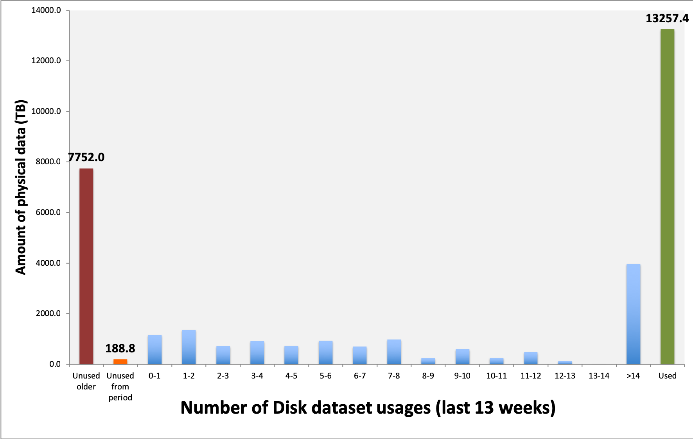

Popularity Analysis
===================

The analysis is performed based on an Excel spreadsheet available in the repository. This spreadsheet takes the raw data contained in the :ref:`popularityCSV` and makes statistics on them.

*****************
Spreadsheet setup
*****************

For some obscure reason, the spreadsheet needs a bit of manual actions.

You first need to manually copy all the data from the popularity.csv file to the "Popularity data" tab of the spreadsheet, starting line 2. You can then extend the "Popularity Formulas" tab to the same number of lines. It would be nice if Excel was doing that automatically, but...

*******************
Spreadsheet content
*******************

The spreadsheet is divided into several tabs.

Popularity Data
***************

Just a copy paste of the popularity.csv

Dataset statistics
******************

The dataset statistics tab is a frequency table. The first column is the bin size, while all the others are the values inside the given bin.

The aim of this tab is to give a global overview of the number of replicas, archives, size, etc used per dataset

Popularity formulas
*******************

This tab crunches the popularity.csv data. It uses some value from other tabs as parameters. In particular:

* A1, name StorageType: type of storage we are doing statistics on. Normally, disk
* A2, named NbOfWeeks: taken from `PopularityPlots.L16`. It is the number of weeks on which we do our statistics

The fields are the following

 * Disk: useless, place holder for A2
 * Name: like popularity.csv
 * Configuration: like popularity.csv
 * ProcessingPass: like popularity.csv
 * Storage: like popularity.csv
 * NbLFN: like popularity.csv
 * FileType: like popularity.csv
 * Disk Real Data: DiskSize of popularity.csv if the dataset is real data
 * Disk MC: DiskSize of popularity.csv if the dataset is MC or Dev
 * Usage: takes the number of usage at NbOfWeeks from the popularity data
 * Norm. Usage: defined as `Usage/NbLFN` if the `Storage` is `StorageType`, -1 otherwise
 * AgeWeeks: What it says (`Now - creationWeek`), if the `Storage` is `StorageType`. -1 otherwise
 * Age Real Data: same as `AgeWeeks` if the dataset is real data, but in years (so divided by 52)
 * Age MC: same as `AgeWeeks` if the dataset is MC or Dev, but in years
 * Last usage in weeks: number of weeks since it has not been used (`Now - LastUsage`). Caution ! LastUsage is a week number in the popularity data
 * Usage span: Number of weeks during which the dataset was used
 * Age at last Usage: in years, only if the `Storage` is `StorageType`, -1 otherwise
 * Age at first usage: in years, only if the `Storage` is `StorageType`, -1 otherwise
 * Age of unused datasets: in years, if the data was never used the last `NbOfWeeks` weeks and if the `Storage` is `StorageType`. -1 otherwise
 * Age of used datasets: in years, if the data was used the last `NbOfWeeks` weeks and if the `Storage` is `StorageType`. -1 otherwise
 * Nb Replicas UnusedOld: Number of replicas of the dataset if it is unused  and its older than `NbOfWeeks` (`Age of unused dataset > NbOfWeeks/52` ) (folks from the Scrutiny group want that)
 * OverSize: see below
 * Archives Real Data: for real data on `StorageType`, this is the number of ArchReps (see `Nb ArchReps` bellow). -1 otherwise
 * Archives MC: For MC or Dev data on `StorageType`, this is the  number of ArchReps (see `Nb ArchReps` bellow). -1 otherwise
 * (Rep-1)/Arch: see bellow
 * (Rep-2)/Arch: see bellow
 * Nb Replicas: like popularity.csv
 * Nb ArchReps: like popularity.csv

-------------
A bit of math
-------------

There are a few formulas in the popularity that are useful to discriminate badly replicated datasets. Here is how:

In a dataset of `NbLFN` files, `N` will be correctly replicated to disks, and `n` will not be::

  NbLFN = N + n

If we make the assumption that a file is either replicated the correct number of time, or not at all, you have::

  NbReplicas = (k*N + n) / (N + n)
  NbArchRep = N / ( N + n)

where `k` is the target number of replicas.

In the case where data has 2 disk copies and one archive, you can then compute the following::

  (NbReplicas - 1)/NbArchRep = 1

  (NbReplicas - 2)/NbArchRep = -n / N

This helps finding pathological datasets, as in ideal case, these values will respectively be 1 and 0.

In the old case where data has 3 disk copies and one archive, you can then compute the following::

  (NbReplicas - 1)/NbArchRep = 2

  (NbReplicas - 2)/NbArchRep = (N - n) / N

Ideally these values will respectively be 2 and 1.

Any other values would show that the dataset is not perfectly replicated.

Another interesting value to compute is `OverSize`. This is basically an estimate of how much space (TB) is uselessly consumed if we assume that a dataset that wasn't used during the `NbOfWeeks` period should have only 1 replicas::

  OverSize = (DiskSize)*([Nb Replicas UnusedOld]-1)/[Nb Replicas UnusedOld]

Popularity plots
****************

This tab contains a lot of plots.
It is a frequency table, just like the Dataset statistics tab, but containing data regarding the popularity and number of accesses.

---------
RRD plots
---------

The RRD plots are interested in a plot like the one bellow.

This translate how many TB on disks have been used 1, 2, ..., 14 times in the last `n` weeks. Note that these is physical size, so the number of replicas counts! There are two special bins:

* Unused older: these datasets were created before `n` weeks ago, and were not used in the last `n` weeks
* Unused from period: these datasets were created during the last `n` weeks

For a reason which is known to them only, but certainly is very well justified, they want these plots for 13, 26 and 52 weeks.