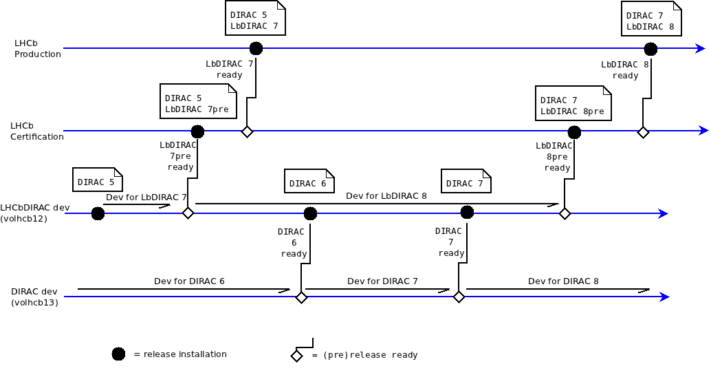
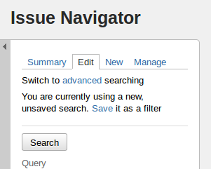

===============================================================
Guide for developing LHCbDIRAC (and DIRAC, for LHCb developers)
===============================================================

.. toctree::
   :maxdepth: 2
   
A short, but hopefully comprehensive guide on developing in LHCbDIRAC, with some reference on DIRAC development. For what is DIRAC, and what is LHCbDIRAC, look elsewhere.

LHCbDIRAC is a DIRAC extension. This means that LHCbDIRAC cannot leave independently from DIRAC. There are a number of DIRAC extensions, maintained by various communities worldwide, and LHCbDIRAC is the most important out there, and the one that receives the most support by DIRAC itself. But it also means that DIRAC and LHCbDIRAC (as all the other DIRAC extensions) have different `release cycles <http://en.wikipedia.org/wiki/Software_release_life_cycle>`_ and `versioning <http://en.wikipedia.org/wiki/Software_versioning>`_, adopts different `version control systems <http://en.wikipedia.org/wiki/Version_control_system>`_, use different `tracking systems <http://en.wikipedia.org/wiki/Issue_tracking_system>`_, and that the `code conventions <http://en.wikipedia.org/wiki/Code_conventions>`_ may slightly differ.

DIRAC can also have other extensions, independent from a VO. All these are hosted at `github <https://github.com/DIRACGrid>`_.


Pre-requisites
==============

Within this section we just look at what is necessary to know before looking at the code.

Releases
---------

Naming
```````

Both DIRAC and LHCbDIRAC follow the same naming conventions for releases, inherithed by the LHCb convention:

**vMrNpt**

where:

- **M** stands for *major version*, or simply *version*
- **N** stands for *minor version*, or simply *release*
- **t** stands for *patch version*, or simply *patch*

with a special *pre-release* naming convention: **-preX**.

This will be clear with some examples:

- **v6r2p0** is the version 6, release 2, patch 0
- **v7r5p13** is the version 7, release 5, patch 13
- **v8r1-pre2** is the second pre-release of version 8, release 1

There are no pre-releases for patches.

Release cycle
``````````````

When developing LHCbDIRAC, we need to consider that every LHCbDIRAC is developed on top of a DIRAC release. The following picture explaines the model.



So, for example. there might be 2 or more LHCbDIRAC releases based on top of the same DIRAC release. Every LHCbDIRAC developers has to know which release of DIRAC its development is for. The major version of both DIRAC and LHCbDIRAC changes rarely, let's say evry 2 years. The minor version changes more frequently in LHCbDIRAC with respect to DIRAC, but there is no strict advancement scheduling for none of the 2.

A pre-release is a release candidate that goes through a certification process. 


Version Control
----------------

LHCbDIRAC version control is based on GIT. GIT is a very popular distributed revision control system. The reader is supposed to be familiar with the way such systems work. The code is hosted in the `CERN GitLab <https://gitlab.cern.ch/lhcb-dirac/LHCbDIRAC>`_. 

DIRAC code is instead hosted in `github <https://github.com/DIRACGrid>`_. 


Tracking systems
-----------------

The tracking system used for LHCbDIRAC is `jira <https://its.cern.ch/jira/browse/LHCBDIRAC>`_, while for DIRAC it has been chosen to use github one. Jira is a fundamental tool for LHCbDIRAC, and its use is mandatory. Every development should be tracked there. Jira is a very powerfool tool, but requires some time to master. Few notes/links:

- The *official documentation* is `here <https://confluence.atlassian.com/display/JIRA/JIRA+User%27s+Guide>`_. You might also be interested in watching the first ~15 minutes of this `video <http://www.youtube.com/watch?v=ca8n9uW3afg&feature=bf_next&list=PLD13EA4D38A021A10>`_. 

- Issuing a new bug/task/story/etc. (there are many possible choices) is easy, just look at the top right of the screen:


- Remember to put a "component" when you make a new issue

- When you make a new research in the issue navigator, you can save the search: it will become useful later




Developer tools
----------------

You are free to choose the editor or IDE you prefer. I know `Emacs <www.gnu.org/s/emacs/>`_ is a great tool, and someone can't just leave without it. And that also `vim <http://www.vim.org/>`_ is great. `Eclipse <http://www.eclipse.org/>`_ with `pydev <http://pydev.org/>`_ is another good choice. Other possibilities include `PyCharm (IntelliJIDEA) <https://www.jetbrains.com/pycharm/>`_ and `atom <https://atom.io/>`_


