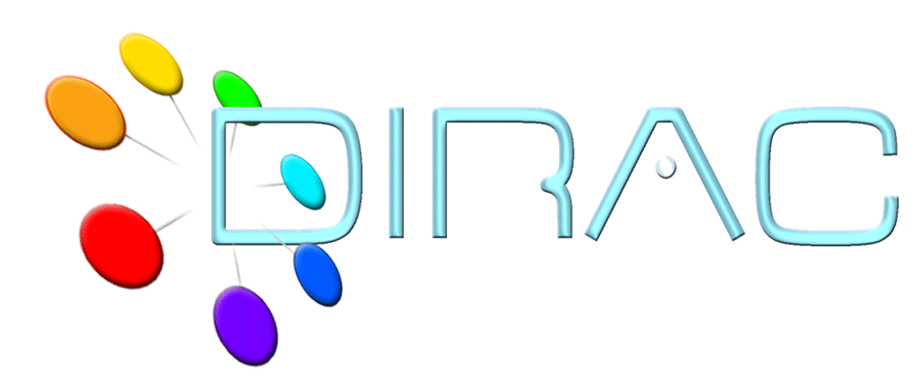

=========================================
LHCbDIRAC Documentation
=========================================

The `DIRAC <http://diracgrid.org/>`_ project is a complete Grid solution for a community of users such as the LHCb Collaboration.
DIRAC forms a layer between a particular community and various compute resources to allow optimized, transparent and reliable usage:

  - DIRAC documentation: `<http://dirac.readthedocs.io/en/latest/index.html>`_
  - DIRAC hosted repository: `<https://github.com/DIRACGrid>`_

LHCbDIRAC is the LHCb extension to DIRAC:

  - LHCbDIRAC documentation: `<http://lhcb-dirac.readthedocs.io/en/latest/index.html>`_
  - LHCbDIRAC hosted repository: `<https://gitlab.cern.ch/lhcb-dirac>`_

.. toctree::
   :hidden:

   DevsGuide/tree.rst
   AdministratorGuide/tree.rst
   Certification/tree.rst
   `Code Documentation <http://lhcb-release-area.web.cern.ch/LHCb-release-area/DOC/lhcbdirac/>`_.

Indices and tables
==================

* :ref:`genindex`
* :ref:`search`
